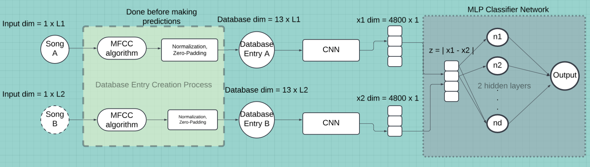

# 🎵 Resona: A Music Similarity Learning System

## Overview
Resona is a deep learning network that aims to generate feature-based/content-based predictions and recommendations. What this means practilly is that this is a system
that tries to use MP3 files, of known songs in a database, to compare it to other known songs in a database and recommend the "most similar" songs.

There are a few key observations to note:
1. How do you define "similarity" of two songs? This is a matter of subjectivity, mostly, however we like to believe that there are some quantifiable properties, or learnable      features, that we can extract from audio to help us more objectively decide how similar two songs are.
   The easiest way to understand how we can use deep learning to accomplish this is to think of the problem a little bit differently: Suppose I know two songs are similar, according
my own music tastes (thereby giving the pair a label). Then I can work backwards to try and figure out if there are any learnable patterns as to why I think this way, and use this same logic on new songs I haven't heard before to make an estimation as to whether they will be "similar" as well.
2. Many services already provide content recommendation, obviously. Spotify, AppleMusic, YouTube Music, etc. all have some recommendation algorithm in place. However, we suspect that most of these algorithms weigh far more heavily on user metadata and application usage data rather than the style of recommending we are building here.
     Of course, that's not to say that recommending music based on what other people are most likely to listen to is not worthwhile, but we are trying to explore "content-based" recommenders in the context of music and audio files.
3. How are you going to train a model to learn? The main idea for training the model was stated in the first point: create and label pairs of songs, and use something (called a siamese twin network) to try and learn how to predict the degree of similarity between two labeled songs.
   A natural follow-up question is of course: how are you going to label this data? For the sake of having a large number of samples to train on, the easiest and most convenient way is to use genre as a means to classify two songs as similar (label 1) or not (label 0) So this turns into basically a binary classification problem, where the output probabilty can be interpreted as a measure/score of similarity between two songs.

The following text outlines, from start to finish, how the model was designed, developed, trained, and deployed on a small database of 100 songs.   

## Features
- Siamese neural network for song similarity
- MFCC-based feature extraction
- PyTorch model with CNN + MLP architecture
- CLI-based song recommendation interface

## Architecture Diagram


1. Database creation entry process:
    The first thing that follows in the top-level pipeline is 


## Dataset
- Songs organized by genre
- Automatic positive/negative pair generation
- Preprocessed features saved in a database

## Model
- CNN with adaptive pooling, together with a MLP classifier network that essentially functions as a binary classification network
- Cross-entropy loss (only 2 labels for a pair)
- Evaluated on 700 vs. 4000 sample training splits

## Usage
### Training
```bash
python train.py
